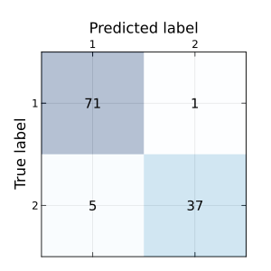
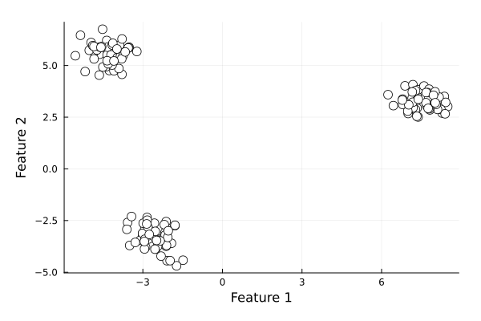
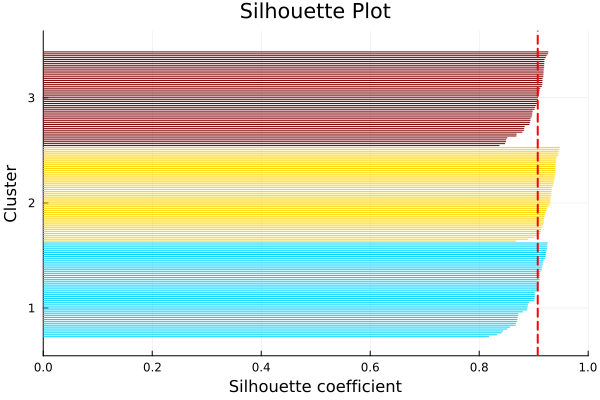

# Model Evaluation

NovaML provides a range of tools and metrics for evaluating the performance of machine learning models. This page covers the main evaluation techniques and metrics available in NovaML.

## Classification Metrics

### Accuracy Score

Accuracy is the ratio of correct predictions to total predictions.

```julia
using NovaML.Metrics

y = [0, 1, 1, 0, 1];
ŷ = [0, 1, 0, 0, 1]

accuracy = accuracy_score(y, ŷ);
println("Accuracy: $accuracy")
```

Following example load the Wisconsin Breast Cancer dataset, splits it to training and test sets and traing a logistic regression model with the training set. Then it calculates the accuracy_score for training and test sets. 

```julia
using NovaML.Datasets: load_breast_cancer
X, y = load_breast_cancer(return_X_y=true)

using NovaML.ModelSelection
Xtrn, Xtst, ytrn, ytst = train_test_split(X, y, test_size=0.2,
                                          stratify=y, random_state=1)

using NovaML.LinearModel
lr = LogisticRegression()

# train the model
lr(Xtrn, ytrn)

using NovaML.Metrics
ŷtrn, ŷtst = lr(Xtrn), lr(Xtst)

# training data accuracy
accuracy_score(ŷtrn, ytrn)
# test data accuracy
accuracy_score(ŷtst, ytst) 
```

### Confusion Matrix

The confusion matrix provides a detailed breakdown of correct and incorrect classifications for each class.
You can use `confusion_matrix` to create the confusion matrix and `display_confusion_matrix` to display it with labels. 

```julia
using NovaML.Metrics
confmat = confusion_matrix(ytst, ŷtst)
# 2×2 Matrix{Int64}:
#  71   1
#   5  37
```

```julia
display_confusion_matrix(confmat)
#        1    2
#    ----------
# 1 | 71.0  1.0
# 2 |  5.0 37.0
```

We can create a better looking confusion matrix plot using the following function:

```julia
using Plots
using Plots.PlotMeasures

function plot_confusion_matrix(confmat::Matrix)
    n = size(confmat, 1)
    
    heatmap(confmat, 
            c=:Blues, 
            alpha=0.3, 
            aspect_ratio=:equal, 
            size=(300, 300),
            xrotation=0,
            xticks=1:n, 
            yticks=1:n,
            xlims=(0.5, n+0.5), 
            ylims=(0.5, n+0.5),
            right_margin=5mm,
            xlabel="Predicted label",
            ylabel="True label",
            xmirror=true, 
            framestyle=:box, 
            legend=nothing)
    
    for i in 1:n, j in 1:n
        annotate!(j, i, text(string(confmat[i,j]), :center, 10))
    end
    
    plot!(yflip=true)
    
    display(current())
end
```

```julia
plot_confusion_matrix(confmat)
```



### Precision, Recall, and F1 Score

These metrics provide more detailed insights into model performance, especially for imbalanced datasets.

```julia
using NovaML.Metrics

precision_score(ytst, ŷtst)
# 0.9736842105263158
recall_score(ytst, ŷtst)
# 0.8809523809523809
f1_score(ytst, ŷtst)
# 0.925
```

### Matthews Correlation Coefficient

The Matthews Correlation Coefficient (MCC) is a balanced measure for binary classification problems. It takes into account true and false positives and negatives, providing a balanced measure even for classes of different sizes.

$$MCC = \frac{TN \times TP - FN \times FP}{\sqrt{(TP+FP)(TP+FN)(TN+FP)(TN+FN)}}$$

where

- TP: True Positive
- FP: False Positive
- TN: True Negative
- FN: False Negative

MCC ranges from -1 to +1:

- +1 represents a perfect prediction
- 0 represents no better than random prediction
- 1 indicates total disagreement between prediction and observation

```julia
using NovaML.Metrics
matthews_corrcoef(ytst, ŷ)
#0.8872442622820285
```

### ROC Curve and AUC

For binary classification problems, you can compute the Receiver Operating Characteristic (ROC) curve and the Area Under the Curve (AUC).

```julia
ŷprobs = lr(Xtst, type=:probs)[:, 2]
fpr, tpr, _ = roc_curve(ytst, ŷprobs);
# auc score
roc_auc = auc(fpr, tpr)
# 0.9923941798941799
```

We can also plot the receiver operating characteristic curve using `fpr` and `tpr` values.

```julia
plot(fpr, tpr, color=:blue, linestyle=:solid, 
     label="Logistic Regression (auc = $(round(roc_auc, digits=2)))",
     xlabel="False Positive",
     ylabel="True Positive",
     title="Receiver Operating Characteristic Curve")     
plot!([0, 1], [0, 1], color=:gray, linestyle=:dash, linewidth=2, label="Random")
```


## Regression Metrics

We will use the Boston Housing Data in the section. 

First let's import and prepare the data. 

```julia
using NovaML.Datasets
X, y = load_boston(return_X_y=true)
```

Prepare the training and test data sets.

```julia
using NovaML.ModelSelection
Xtrn, Xtst, ytrn, ytst = train_test_split(X, y, test_size=0.3, random_state=123)
```

Create and fit the linear regression model.

```julia
lr = LinearRegression()
lr(Xtrn, ytrn)
ŷtrn = lr(Xtrn)
ŷtst = lr(Xtst)
```

### Mean Absolute Error (MAE)

MAE measures the average magnitude of errors in a set of predictions, without considering their direction.

```julia
using NovaML.Metrics
maetrn = mae(ytrn, ŷtrn)
maetst = mae(ytst, ŷtst)
maetrn, martst
#(0.07, 0.09)
```
### Mean Squared Error (MSE)

MSE measures the average squared difference between the estimated values and the actual value.

```julia
msetrn = mse(ytrn, ŷtrn)
msetst = mse(ytst, ŷtst)
msetrn, msetst
#(0.0093, 0.0128)
```
### R-squared Score

R-squared (R²) provides a measure of how well observed outcomes are replicated by the model, based on the proportion of total variation of outcomes explained by the model.

```julia
r2_score(ytrn, ŷtrn)
# 0.9992871136620213
r2_score(ytst, ŷtst)
# 0.9991476060812577
```

## Clustering Metrics

### Silhouette Score

The Silhouette Score is used to evaluate the quality of clusters in clustering algorithms.

Let's first create an artificial dataset.

```julia
using NovaML.Datasets
X, y = make_blobs(
    n_samples=150,
    n_features=2,
    centers=3,
    cluster_std=0.5,
    shuffle=true,
    random_state=123)

using Plots
begin
    scatter(X[:, 1], X[:, 2],
            color=:white,
            markerstrokecolor=:black,
            markersize=6,
            xlabel="Feature 1",
            ylabel="Feature 2",
            grid=true,
            legend=false)
    
    plot!(size=(600, 400), margin=5Plots.mm)
end
```


Next, create the clustering algorithm.

```julia
using NovaML.Cluster
km = KMeans(
    n_clusters=3,
    init="k-means++",
    n_init=10,
    max_iter=300,
    tol=1e-04,
    random_state=0)

km(X)
```
Now we can create the Silhouette Plot using the `silhouette_samples` from `NovaML.Metrics`.

```julia
using Statistics
using ColorSchemes
using NovaML.Metrics

function plot_silhoutte(km::KMeans)
    ykm = km.labels_
    cluster_labels = sort(unique(km.labels_))
    n_clusters = length(cluster_labels)
    silhouette_vals = silhouette_samples(X, km.labels_, metric="euclidean")
    δ = 1. / (length(silhouette_vals)+20)
    yval = 10δ
    
    p = plot(xlabel="Silhouette coefficient", label="Cluster", title="Silhouette Plot", legend=false, ylims=(0.0, 1.0), xlims=(0.0, 1.0), ylabel="Cluster");
    for (i, c) in enumerate(cluster_labels)
        c_silhouette_vals = silhouette_vals[ykm.==c]
        sort!(c_silhouette_vals)
        color = get(ColorSchemes.jet, i/n_clusters)
        for xval in c_silhouette_vals
            plot!(p, [0, xval], [yval, yval], color=color)
            yval += δ
        end
    end
    silhouette_avg = mean(silhouette_vals)
    vline!([silhouette_avg], color=:red, linestyle=:dash, lw=2)
    
    start = (1-20δ)/6
    stop = (1 - 10δ) - (1-20δ)/6
    
    yticks!(p, range(start, stop, length=n_clusters), string.(cluster_labels))    
end
```

